# Crypto Questor

<p align="center">
  Crypto Questor is a comprehensive cryptocurrency tracking and portfolio management app. Monitor real-time prices, market capitalizations, and trading volumes, manage your personal portfolio, and review historical transactions. Discover promotions and campaigns from exchanges and take advantage of free airdrop opportunities to maximize your earnings.
</p>

# Screenshots
## Dark
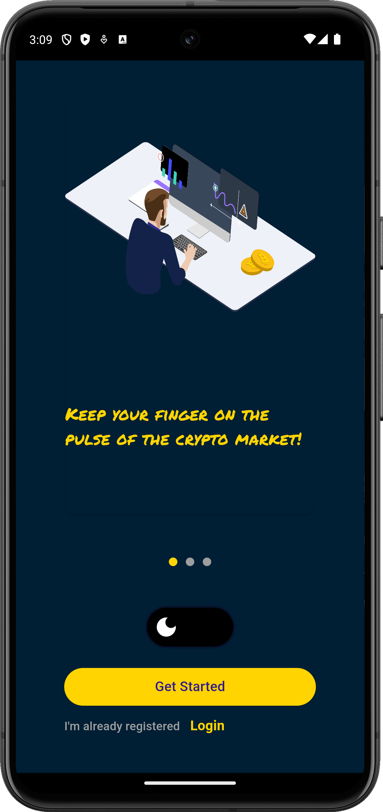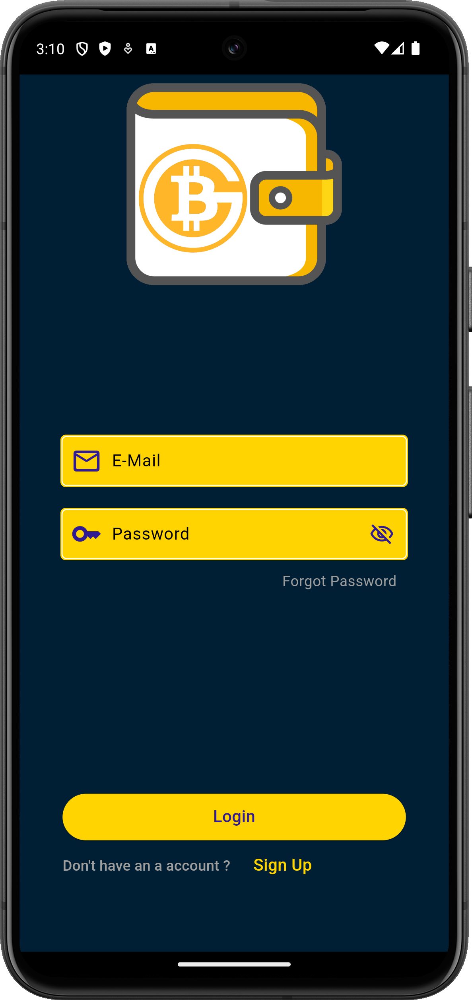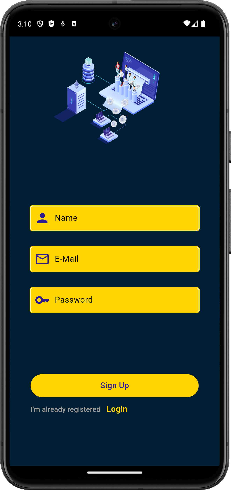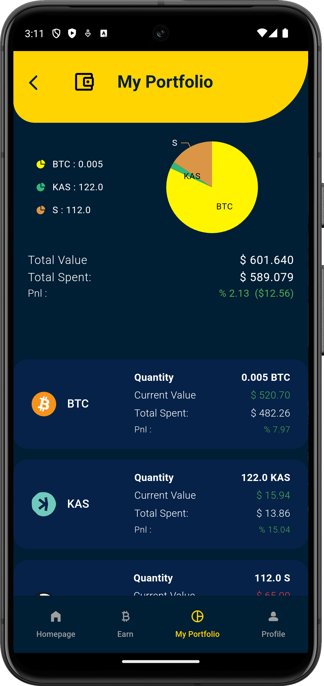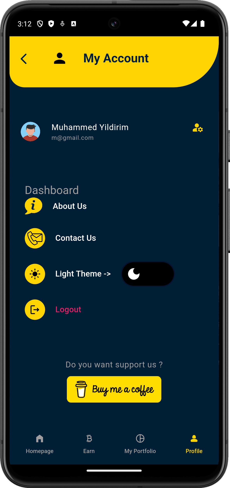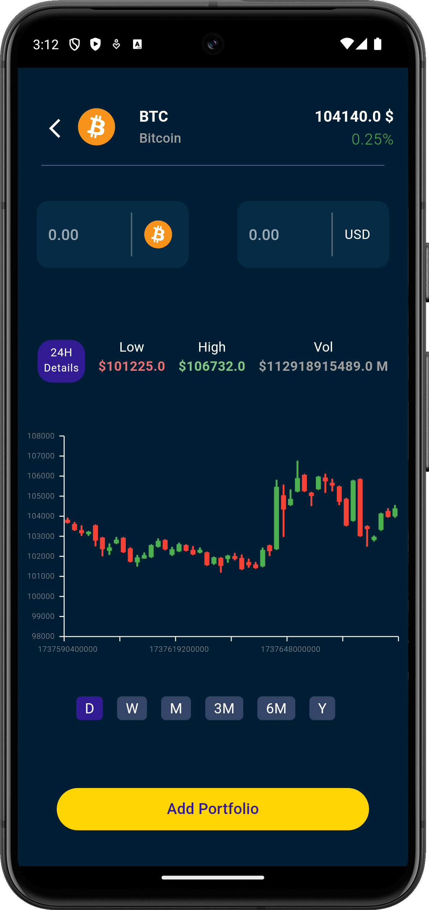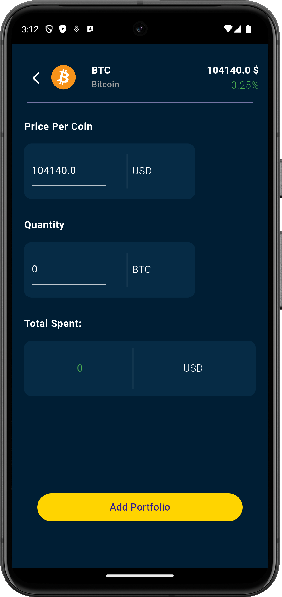


## Light
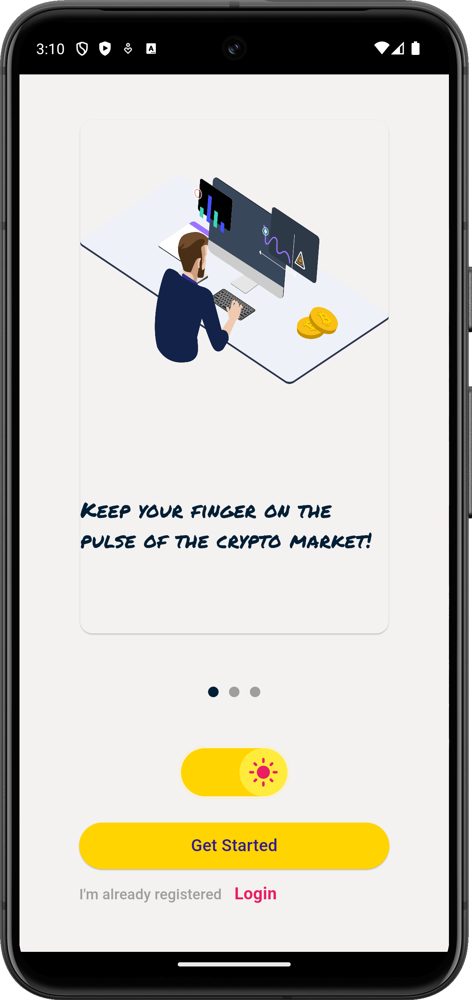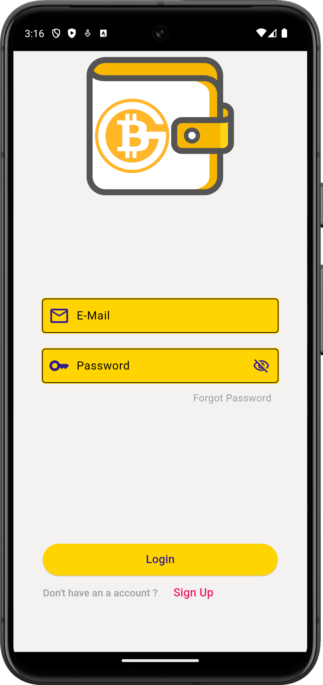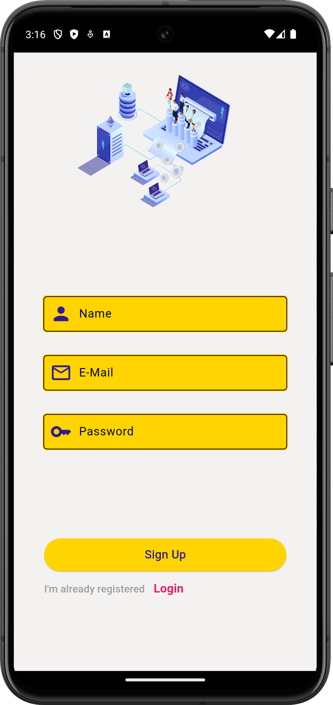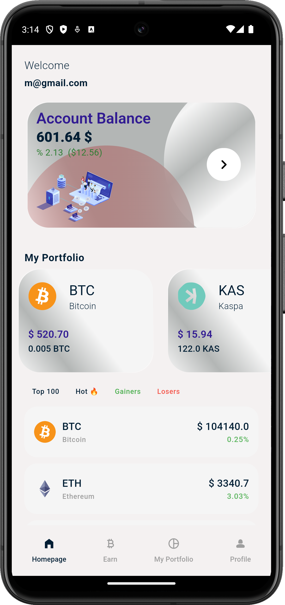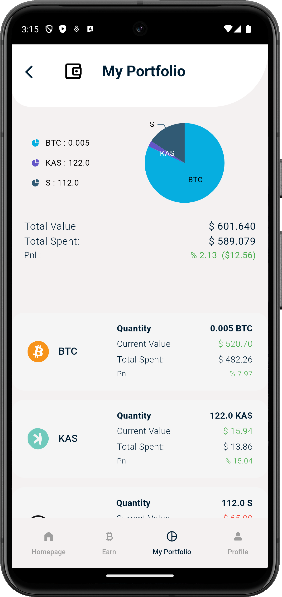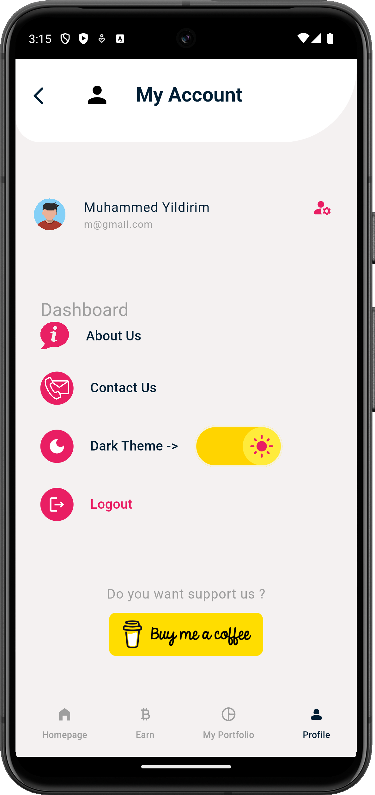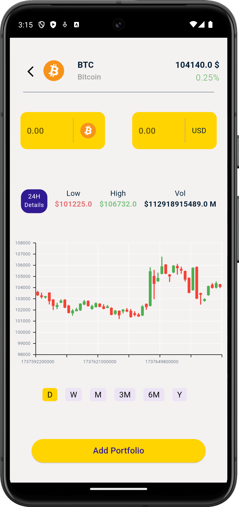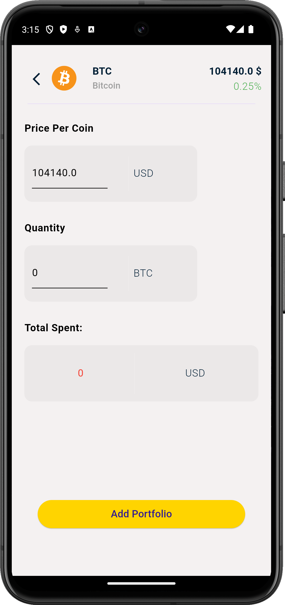  

## Features
- Track real-time cryptocurrency prices, market capitalizations, and trading volumes with live updates.
- Create and manage a personalized portfolio by adding and organizing multiple cryptocurrencies.
- View, edit, and analyze historical transactions to optimize portfolio management.
- Access exclusive promotions and campaigns from exchanges and other platforms.
- Discover free airdrop opportunities and explore ways to earn additional cryptocurrencies.
- Enjoy secure login with Firebase Authentication for a seamless user experience.
- Develop a cross-platform application using Flutter.

## Localized Languages
- Turkish
- English


## Project Structure

```
📂 lib
  📂 feature               # pages and management of the application.
  📂 product               # core utilities, constants, and shared components.
  📂 l10n                  # localization files for multi-language support. 
  📄 main.dart  
📄 build.yaml
📄 pubspec.yaml      
```

* **feature:** This folder contains the pages and management of the application. If we take a page (home) inside the view folder as an example...
```
📂 feature
 📂 view
  📂 home_page
   📄 home_page.dart 
   📂 mixin
    📄 home_page_mixin.dart
   📂 widget
    📄 all_coins_widget.dart
    📄 categoires_names_part_widget.dart
    📄 categories_coins_part_widget.dart
    📄 sorted_hot_coins_widget.dart
```

* **product:** This folder contains the pages and management of the application. If we take a folder (services) inside the as an example...
```
📂 services                              # The folder handles external operations like API calls, authentication, and database interactions
 📂 coin_service                         # The folder handles API operations for fetching cryptocurrency data from CoinGecko.
   📄 coin_service.dart
 📂 firebase_service                     # The folder handles CRUD operations and authentication tasks with Firebase.
   📄 firebase_service.dart
   📄 firebase_exception_manager.dart
📂 extension                             # utility functions and extensions for common operations.
📂 init                                  # handles the initialization of services and dependencies.
📂 locator                               # for dependency injection and service location.
📂 models                                # data models and structures used in the application.
📂 repository                            # manages the data layer, handling data fetching and storage.
📂 components                            # contains reusable UI elements and widgets for the app.
```

## Dependencies

- state management
  * [provider](https://pub.dev/packages/provider)
    
- services
  * [http](https://pub.dev/packages/http)
  * [firebase_core](https://pub.dev/packages/firebase_core)
  * [firebase_auth](https://pub.dev/packages/firebase_auth)
  * [cloud_firestore](https://pub.dev/packages/cloud_firestore)
  * [url_launcher](https://pub.dev/packages/url_launcher)
     
- Utils
  * [get_it](https://pub.dev/packages/get_it)
  * [json_annotation](https://pub.dev/packages/json_annotation)
  * [equatable](https://pub.dev/packages/equatable)

- UI
  * [flutter_native_splash](https://pub.dev/packages/flutter_native_splash)
  * [syncfusion_flutter_charts](https://pub.dev/packages/syncfusion_flutter_charts)
  * [animated_toggle_switch](https://pub.dev/packages/animated_toggle_switch)
  * [carousel_slider](https://pub.dev/packages/carousel_slider)
    
- dev_dependencies
  * [build_runner](https://pub.dev/packages/build_runner)
  * [json_serializable](https://pub.dev/packages/json_serializable)
  * [very_good_analysis](https://pub.dev/packages/very_good_analysis)


## Thanks
- Learn the development processes of this project inspired by the https://www.youtube.com/HardwareAndro
